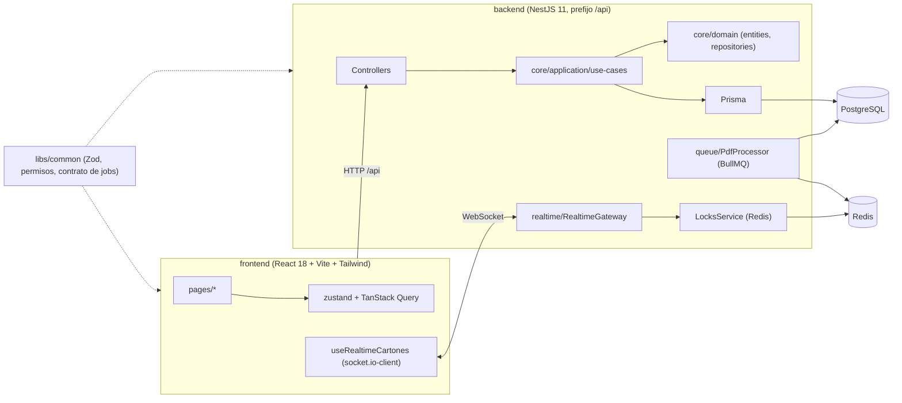

<div align="center">
  
  <h1>Bingo Imperial</h1>
  <p><b>Sistema de venta de cartones de bingo para equipos de vendedores: API NestJS, PWA en React y sincronización en tiempo real.</b></p>
  
  
  
  
  
  
  <p>
    <a href="#-inicio-rápido">Inicio rápido</a> ·
    <a href="#-características">Características</a> ·
    <a href="#-arquitectura">Arquitectura</a> ·
    <a href="#-pruebas">Pruebas</a> ·
    <a href="#-lo-que-todavía-no-existe">Limitaciones</a>
  </p>
</div>

Bingo Imperial es la reescritura, como monorepo TypeScript, de un sistema anterior Android + Flask. Los administradores suben PDFs con cartones;
los vendedores los **reservan, venden o liberan** desde una PWA, y los cambios se propagan a todos por WebSocket. **No es** un sistema terminado:
el procesamiento de PDF actual es una prueba de concepto y el repositorio no incluye pruebas automatizadas.

## 🎬 Vista rápida

Sin capturas: la app necesita PostgreSQL, Redis y Ghostscript/GraphicsMagick (para `pdf2pic`) y no se levantó para este README. Flujo principal según el código:

```text
Admin     → sube un PDF (por partes) → la API lo encola (BullMQ) → se genera imagen de cartón
Vendedor  → lista/busca cartones → toca uno (bloqueo temporal en Redis) → reserva / vende / libera
Todos     → ven el cambio al instante (eventos Socket.IO: reservado, vendido, liberado, bloqueado)
Admin     → dashboard, reportes Excel/PDF, auditoría, grupos, usuarios y permisos del rol vendedor
```

## ✨ Características

| Característica | Detalle |
|---|---|
| Cartones | Listado, búsqueda por número, detalle con imagen; estados `disponible`, `vendido`, `reservado`; vender/reservar/liberar con transacciones Prisma y borrado |
| Tiempo real | `RealtimeGateway` (Socket.IO): evento `carton:tap` con bloqueo temporal en Redis (`SET NX EX`, liberación con script Lua) y difusión de cambios de estado |
| PDFs | Subida en partes (`subir-pdf`, `pdf-parte`, `pdf-completar`), estados de procesamiento y cola BullMQ |
| Usuarios y grupos | Roles `admin` y `vendedor`; grupos de vendedores; CRUD de usuarios y grupos |
| Permisos configurables | Para el rol vendedor: `subir_pdf`, `vender`, `reservar`, `liberar` (editables por el admin) |
| Autenticación | Login con JWT; verificación de hashes compatibles con Werkzeug (usuarios migrados de Flask) y argon2 para el resto |
| Reportes y dashboard | Estadísticas, reporte en Excel y en PDF, gráficos (Recharts) |
| Auditoría | Tabla `AuditLog` y pantalla de auditoría |
| Banners | CRUD de banners con imagen |
| PWA | `vite-plugin-pwa` (autoUpdate), manifiesto "Recorte Bingo", prompt de instalación |
| Migración | `tools/migrate-sqlite`: importa la base SQLite anterior (usuarios, grupos, cartones, PDFs) y guía de corte |

## 🏗️ Arquitectura



## 🚀 Inicio rápido

| Requisito | Versión |
|---|---|
| Node.js | >= 22 (`engines`) |
| pnpm | 10 (`packageManager`) |
| Docker | para PostgreSQL 16 y Redis 7 de desarrollo |
| Ghostscript + GraphicsMagick | los necesita `pdf2pic` para convertir PDFs |

```bash
pnpm install
cp .env.example .env                 # completa DATABASE_URL, REDIS_URL, JWT_SECRET, DATA_DIR
pnpm infra:up                        # postgres (puerto 5433) + redis (6379)
pnpm --filter @bingo/common build
pnpm --filter backend prisma:migrate
pnpm --filter backend seed           # admin inicial y permisos por defecto

# en terminales separadas
PORT=4000 pnpm dev:api               # el proxy de Vite apunta a http://localhost:4000
pnpm dev:web                         # PWA en http://localhost:5180
```

> No verificado: estos comandos no se ejecutaron en esta revisión. El puerto por defecto de la API es 3000; el proxy de Vite espera 4000, por eso `PORT=4000`.
> La contraseña del admin viene de `ADMIN_PASSWORD` (por defecto, un valor de desarrollo): cámbiala.

<details>
<summary>Variables de entorno (.env.example)</summary>

| Variable | Uso |
|---|---|
| `DATABASE_URL` | Conexión PostgreSQL (Prisma) |
| `REDIS_URL` | Redis para la cola y los bloqueos de cartones (`REDIS_HOST`/`REDIS_PORT`/`REDIS_PASSWORD` siguen aceptándose si `REDIS_URL` no está) |
| `JWT_SECRET` | Obligatorio para firmar tokens (`getOrThrow`) |
| `DATA_DIR` | Carpeta de PDFs, imágenes y banners |
| `ADMIN_PASSWORD` | Contraseña del admin sembrado |
| `POSTGRES_USER`, `POSTGRES_PASSWORD`, `POSTGRES_DB` | Solo `docker-compose.prod.yml` |

</details>

<details>
<summary>Estructura de carpetas</summary>

```text
backend/        NestJS: auth, cartones, pdfs, queue, realtime, grupos, users, permisos,
                reportes, dashboard, audit, banners, storage; prisma/ (schema + migraciones + seed)
  src/core/     Arquitectura limpia: domain (entities, repositories) y application/use-cases
frontend/       PWA React: pages, components, hooks, stores, api
libs/common/    Schemas Zod, permisos y contrato de jobs compartidos
docker/         docker-compose.dev.yml y docker-compose.prod.yml (Coolify)
tools/migrate-sqlite/   Migración desde el sistema Flask
specs/ y spect/ y docs/ Specs 001–007, notas de arquitectura y constitución del proyecto
```

</details>

<details>
<summary>Despliegue (Coolify)</summary>

`docker/docker-compose.prod.yml` define `postgres`, `redis`, `api` y `frontend` (nginx sirve la PWA y hace proxy de `/api`). Variables obligatorias: `POSTGRES_PASSWORD` y `JWT_SECRET`.

</details>

## 🧪 Pruebas

`pnpm test` ejecuta Vitest en `backend/` (hoy solo cubre la resolución de la conexión Redis). No hay CI. La estrategia prevista está en `spect/testing.md` (documento de planificación).

## 🔒 Seguridad

- Login con JWT; `JWT_SECRET` es obligatorio al arrancar.
- Guards de JWT y de permisos por rol; permisos del vendedor configurables.
- Hashes de contraseña con argon2 y compatibilidad con hashes Werkzeug de la migración.
- Bitácora de auditoría de acciones.
- Puntos débiles: `enableCors({ origin: true })` y gateway con `cors: { origin: '*' }`; sin limitador de intentos de login visible en el código; la contraseña inicial del admin tiene un valor por defecto de desarrollo.

## 🚧 Lo que todavía no existe

- El procesador convierte **solo la primera página** de cada PDF ("prueba de concepto" según el propio comentario del código); el recorte y armado completo del cartón no están.
- Cobertura de pruebas más allá de la configuración de Redis, y CI.
- Sin archivo de licencia.

## 📄 Licencia

Sin licencia definida: todos los derechos reservados por defecto.

<div align="center"><sub>Hecho por Luiss2080 · Bingo Imperial</sub></div>
